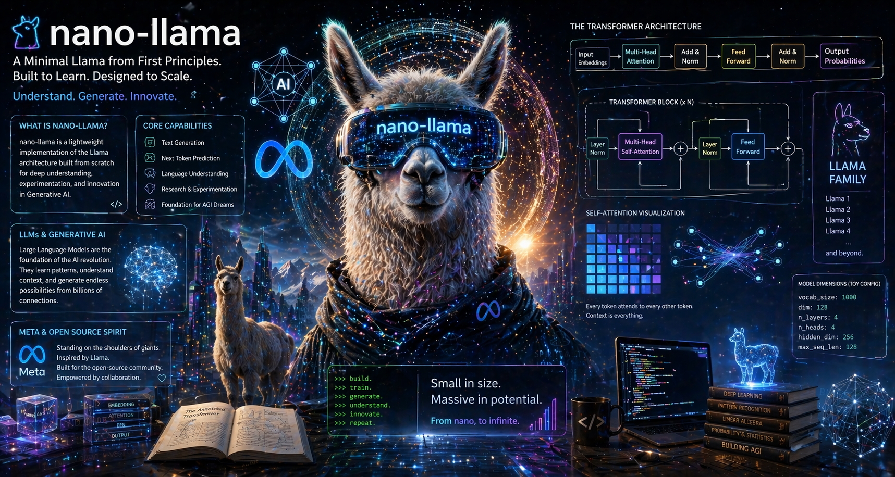

  

# nano-llama

A minimal implementation of the Llama-style Transformer architecture

## Features (planned)
- RMSNorm
- RoPE (Rotary Positional Embeddings)
- SwiGLU Feedforward
- Grouped Query Attention (GQA)
- Mixture of Experts (MoE)

## Project Steps

### ✅ Step 1 — Repository Initialized
- GitHub repo created
- README added

### ✅ Step 2 — Project Structure Initialized
- Created core files:
  - `nano_llama.py`
  - `train.py`
  - `infer.py`
- Created folders:
  - `model/`
  - `utils/`
- Added `requirements.txt`

### ✅ Step 3 & 4 — Python Environment Setup
- Created virtual environment (`venv`)
- Installed dependencies (`torch`, `numpy`)
- Verified model runs successfully

### ✅ Step 5 — Base Entry Script
- Separated model definition from execution
- Created `train.py` as entry point
- Cleaned `nano_llama.py` (model-only)
- Verified execution via `train.py`

### ✅ Step 6 — Config Class
- Introduced `Config` class for model hyperparameters
- Centralized key settings:
  - vocab size
  - model dimension
  - number of layers and heads
  - sequence length
- Updated model to accept config

#### Hyperparameters:
- vocab_size: Number of unique tokens the model understands → language coverage
- dim: Size/dimensionality of each token's embedding vector → representation power
- n_layers: Number of Transformer blocks → reasoning depth
- n_heads: Number of Attention heads → attention diversity
- hidden_dim: Size of the feedforward layer inside each block → transformation capacity
- max_seq_len: Maximum number of tokens the model can process at once → memory window

### ✅ Step 7 — RMSNorm
- Implemented RMSNorm (Llama-style normalization)
- Replaced identity forward pass with normalization layer
- Verified correct tensor flow and shape

## Status
Step 7 done
